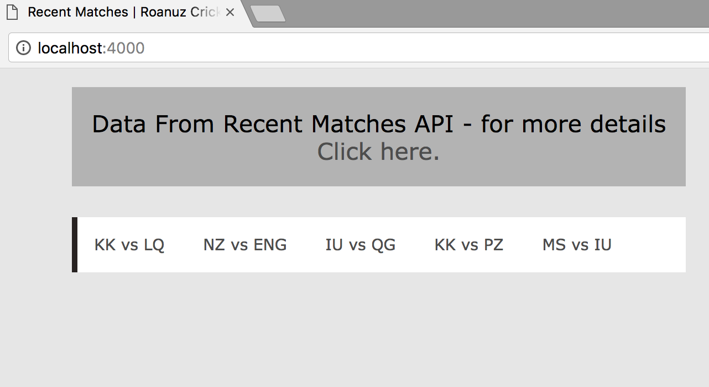
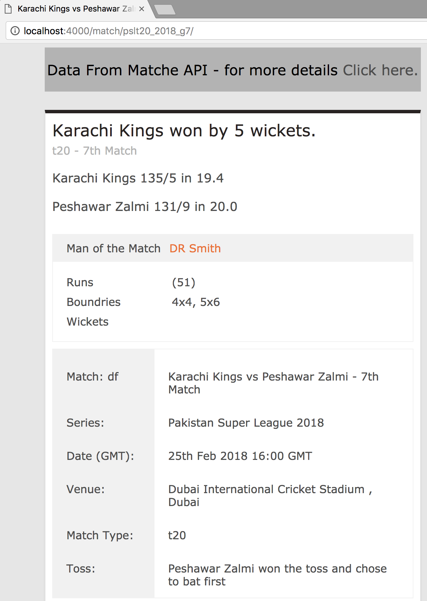

# Cricket API - NodeJS 

**The Boiler plate using NODEJS, Nunjucks and Memcache to develop a sports App to show cricket Score using Roanuz Cricket API apis**

**Initial configuration**

create a .env file with following data on the root folder

```
SC_APP_ID = your_app_id
SC_ACCESS_KEY = your_access_key
SC_SECRET_KEY = your_secret_key
SC_DEVICE_ID = your_device_id
SC_PORT = any port default 4000
SC_ENABLE_MEMCACHE = false
```

**Install Dependencies**

`npm install` to make sure all the packages are installed.

**Compile & Run**

`npm start` to compile and run the app

Note: if you enabled memcache, you need to run as memcached as a service

**Memcache**

Memcache for Ubuntu:
Refer this Link: https://www.journaldev.com/1/how-to-install-memcached-server-on-mac-oslinux

Memcache for Mac:
Refer this Link: https://syscoding.com/tutorials/40/how-to-install-memcached-on-ubuntu-1604/

For more details Check: https://www.cricketapi.com/

**Output**

http://localhost:4000/


http://localhost:4000/match/pslt20_2018_g7/

